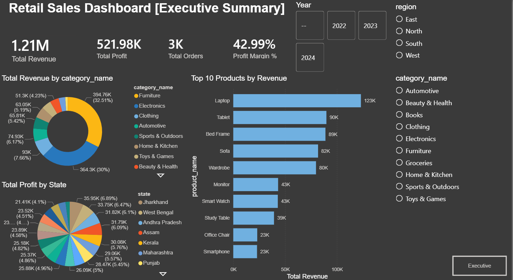
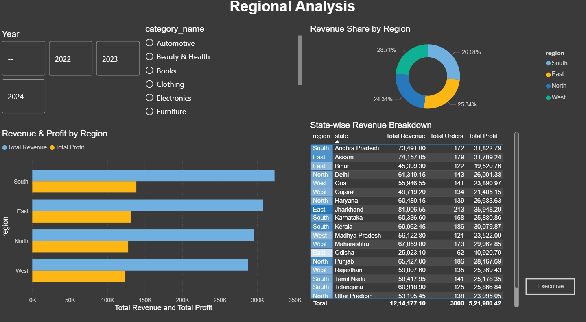
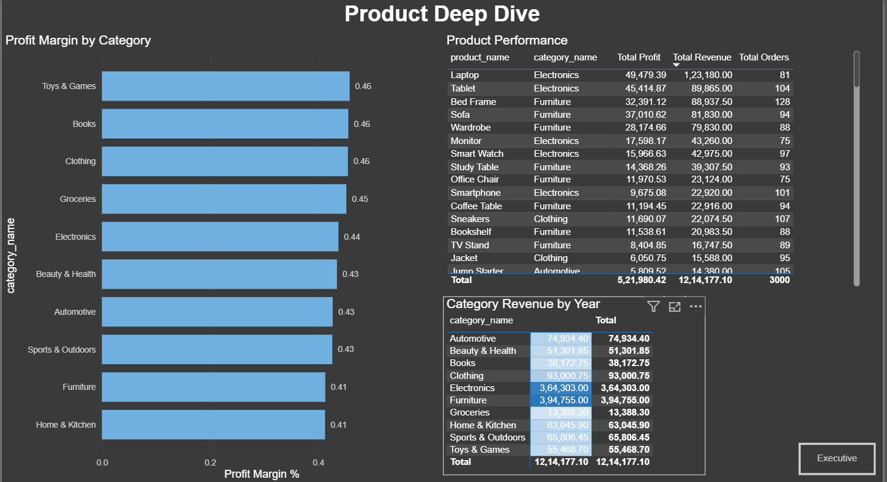
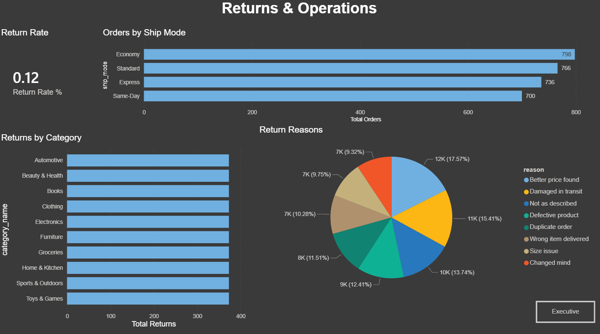
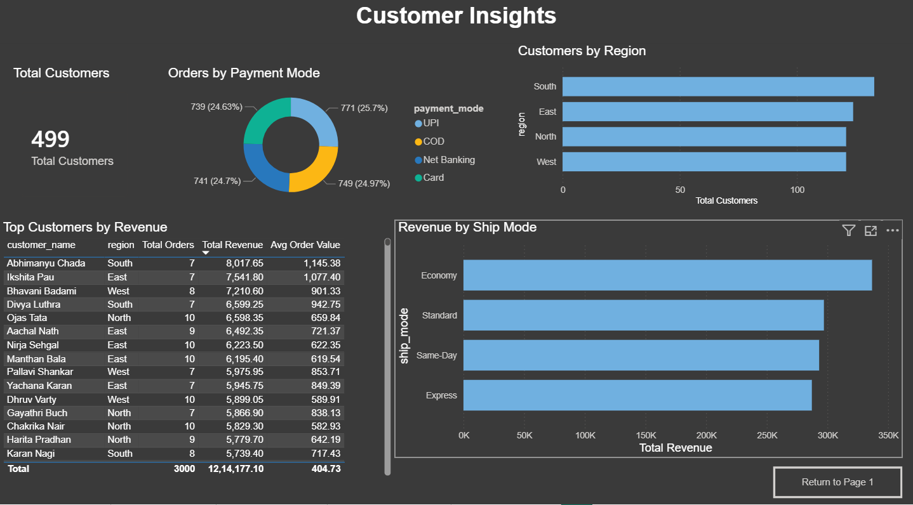

#  Retail Sales Dashboard


> An end-to-end data analytics project — from relational database design to a 5-page interactive Power BI dashboard — built to simulate a real-world retail business intelligence workflow.

---

##  Dashboard Preview

> *(Add your screenshots here after uploading)*

| Page | Preview |
|---|---|
| Executive Summary |  |
| Regional Analysis |  |
| Product Deep Dive |  |
| Returns & Operations |  |
| Customer Insights |  |

---

##  Key Insights

| Insight | Value |
|---|---|
|  Total Revenue | ₹12,14,177 |
|  Total Orders | 3,000 |
|  YoY Revenue Growth (2024) | +20.10% |
|  Top Category | Furniture (32.51%) |
|  2nd Category | Electronics (30.00%) |
|  Top 2 Categories Combined | 62.51% of total revenue |
|  Leading Region | South |
|  Most Popular Payment | UPI |
|  Return Rate | ~12% |

---

##  Project Structure

```
retail-sales-dashboard/
│
├── 📁 sql/
│   ├── 01_schema.sql               # Database schema (6 tables + view)
│   └── 02_analysis_queries.sql     # 17 business analysis queries
│
├── 📁 python/
│   └── retail_data_generator.py    # Fake data generator (pandas + Faker)
│
├── 📁 screenshots/
│   ├── Page1_Executive_Summary.png
│   ├── Page2_Regional_Analysis.png
│   ├── Page3_Product_Deep_Dive.png
│   ├── Page4_Returns_Operations.png
│   └── Page5_Customer_Insights.png
│
├── 📁 powerbi_guide/
│   └── powerbi_setup.md            # DAX measures + dashboard setup guide
│
├── Retail_Sales_Dashboard.pbix     # Power BI dashboard file
└── README.md
```

---

##  Database Schema

Designed a normalized relational schema in MySQL for a fictional retail business:

```
customers ──────┐
                ├──── orders ──── order_items ──── products ──── categories
returns ────────┘
```

| Table | Description | Records |
|---|---|---|
| `customers` | Customer profiles across 4 regions of India | 500 |
| `products` | Product catalog across 10 categories | 100 |
| `categories` | Product categories and departments | 10 |
| `orders` | Order headers (2022–2024) | 3,000 |
| `order_items` | Line-level order details | ~8,500 |
| `returns` | Returned items with reasons | ~180 |

> Also includes `vw_sales_fact` — a flat denormalized view joining all tables, used as the primary data source in Power BI.

---

##  Setup & Installation

### Prerequisites
- MySQL Workbench 8.0+
- Python 3.8+
- Power BI Desktop (free)

### Step 1 — Create the Database
```sql
-- Run in MySQL Workbench
source sql/01_schema.sql
```

### Step 2 — Generate Sample Data
```bash
pip install pandas faker mysql-connector-python sqlalchemy
```
Edit `DB_PASSWORD` in `python/retail_data_generator.py`, then:
```bash
python python/retail_data_generator.py
```
Expected output:
```
 Inserted 10 categories
 Inserted 100 products
 Inserted 500 customers
 Inserted 3000 orders
 Inserted ~8500 order items
 Inserted ~180 returns
 All data loaded into retail_db successfully!
```

### Step 3 — Run Analysis Queries
```bash
-- Run in MySQL Workbench
source sql/02_analysis_queries.sql
```

### Step 4 — Open Power BI Dashboard
- Open `Retail_Sales_Dashboard.pbix` in Power BI Desktop
- Update the MySQL connection: **Home → Transform Data → Data source settings**
- Enter your `localhost` credentials and refresh

---

## 📈 SQL Analysis Queries (17 Total)

| # | Query | Purpose |
|---|---|---|
| Q1 | KPI Totals | Revenue, Profit, Orders, AOV |
| Q2 | Monthly Trend | Revenue & profit by month |
| Q3 | Category Revenue | % contribution per category |
| Q4 | Top 10 Products | Best sellers by revenue |
| Q5 | Region Revenue | Sales by North/South/East/West |
| Q6 | State Revenue | Drill-down by state |
| Q7 | YoY Growth | Year-over-year comparison |
| Q8 | Top Customers | High-value customer ranking |
| Q9 | Ship Mode | Delivery preference analysis |
| Q10 | Payment Mode | Payment method distribution |
| Q11 | Quarterly Breakdown | Q1–Q4 revenue comparison |
| Q12 | Return Rate | Returns by category |
| Q13 | Return Reasons | Most common return reasons |
| Q14 | Profit Margins | Highest margin products |
| Q15 | Customer Segments | New vs Occasional vs Loyal |
| Q16 | Discount Tiers | Revenue by discount level |
| Q17 | Day of Week | Peak sales days |

---

## 📊 Power BI Dashboard Pages

### Page 1 — Executive Summary
KPI cards (Revenue, Profit, Orders, Margin), Monthly Revenue Trend line chart, Revenue by Category donut, Top 10 Products bar chart, slicers for Year / Region / Category.

### Page 2 — Regional Analysis
Revenue & Profit by Region bar chart, Revenue Share donut, State-wise Revenue breakdown table with conditional formatting.

### Page 3 — Product Deep Dive
Category × Year revenue matrix, Profit Margin by Category bar chart, full Product Performance table.

### Page 4 — Returns & Operations
Return Rate KPI card, Returns by Category bar chart, Return Reasons pie chart, Monthly Returns trend, Orders by Ship Mode.

### Page 5 — Customer Insights
Total Customers KPI, Top Customers table, Orders by Payment Mode donut, Customers by Region bar chart, Revenue by Ship Mode.

---

## 🧮 DAX Measures

```dax
Total Revenue    = SUMX('retail_db vw_sales_fact', 'retail_db vw_sales_fact'[revenue])
Total Profit     = SUMX('retail_db vw_sales_fact', 'retail_db vw_sales_fact'[profit])
Total Orders     = DISTINCTCOUNT('retail_db vw_sales_fact'[order_id])
Profit Margin %  = DIVIDE([Total Profit], [Total Revenue], 0)
Avg Order Value  = DIVIDE([Total Revenue], [Total Orders], 0)
Revenue LY       = CALCULATE([Total Revenue], SAMEPERIODLASTYEAR(DateTable[Date]))
YoY Growth %     = DIVIDE([Total Revenue] - [Revenue LY], [Revenue LY], 0)
Return Rate %    = DIVIDE(COUNTROWS('retail_db returns'), [Total Orders], 0)
Total Customers  = DISTINCTCOUNT('retail_db vw_sales_fact'[customer_id])
Total Returns    = COUNTROWS('retail_db returns')
```

---

## 💡 Business Insights Discovered

- **Furniture and Electronics alone drove 62.5% of total revenue** despite being just 2 of 10 categories — suggesting inventory investment should be concentrated here
- **Revenue was flat in 2023 (+0.23%)** but surged **+20.10% in 2024**, indicating strong business growth
- **South region consistently leads** in both revenue and order volume
- **Q4 is peak season** — October to December shows the highest monthly revenue across all years
- **UPI is the dominant payment method** — optimizing UPI checkout experience could reduce cart abandonment
- Products with **no discount** generate higher profit margins than heavily discounted items

---

## 🛠️ Skills Demonstrated

- **Database Design** — normalization, primary/foreign keys, relational schema
- **SQL** — aggregations, window functions (LAG, RANK), CTEs, subqueries
- **Python** — data generation, pandas DataFrames, SQLAlchemy ORM
- **Power BI** — data modeling, DAX measures, time intelligence
- **Dashboard UX** — slicers, drill-through, conditional formatting, page navigation
- **Business Analytics** — KPI definition, trend analysis, segmentation

---

## 👤 Author

**Aryan Singh**
- GitHub: [@aryansinghbais](https://github.com/Aryansingh-B)
- Project: [retail-sales-dashboard](https://github.com/Aryansingh-B/Retail-Sales-Dashboard)

---

## 📄 License

This project is open source and available under the [MIT License](LICENSE).
EOF